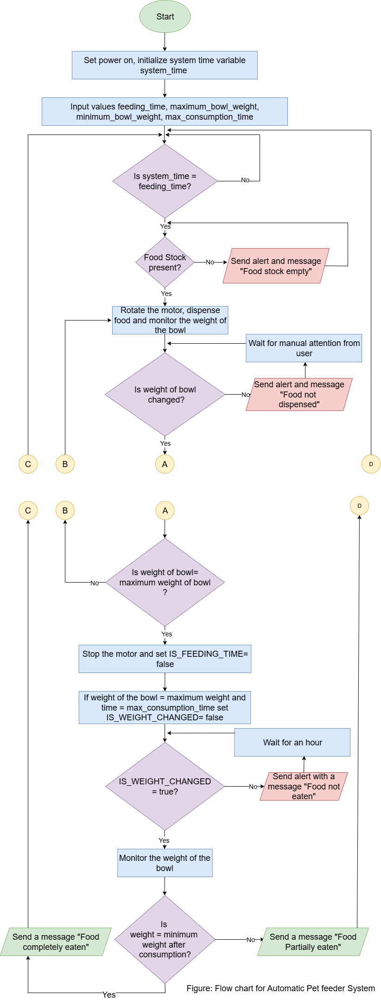

# Planning the Solution

## Work flow for the system

### Step by step analysis for the system flow

1. Start of the system.
2. Input the feeding time, minimum weight of the bowl, maximum weight of the bowl from the user.
3. Check for the feeding time. If it is the feeding time, assign the IS_FEEDING_TIME to be True. If IS_FEEDING_TIME is True, check the food stock, if the food is not present send an alert saying "Food stock empty" else send the signal to the control motor to open the food channel and dispense food. If it is not feeding time, assign IS_FEEDING_TIME false and keep the channel closed.
4. While the food is being dispensed monitor the weight of the bowl, when the weight of the bowl reaches the maximum weight set(example 300g) send a control signal to the dispensing motor and set IS_FEEDING_TIME to False to close the channel.
5. If the weight of the bowl does not increase when the feeding channel is open (IS_FEEDING_TIME = true), send an alert with LED and buzzer with a message "Food not dispensed".
6. After the food has been dispensed and the bowl is full, monitor the weight of the bowl. If the weight of the bowl remains unchanged for certain time (example :5 hours), send an alert with a red LED on and a buzzer with a message "Food is not eaten" and check again after an hour.
7. If the weight of the bowl changes over time and reaches a weight below the minimum weight set, display a message "Food completely eaten", else display a message "Food partially eaten".
8. Keep monitoring the system clock to check for feeding time.

## Flowchart

#### *Assumption: The system continues to run indefinitely unless power has been turned off. Hence, the end state has not been described in the flowchart*

