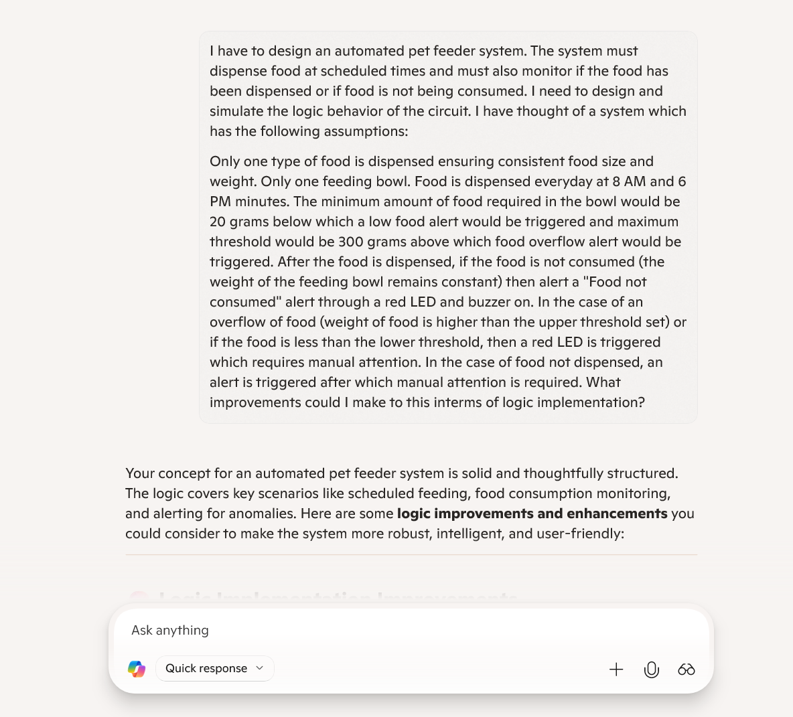
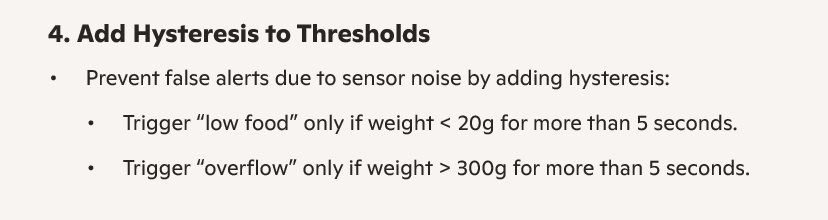
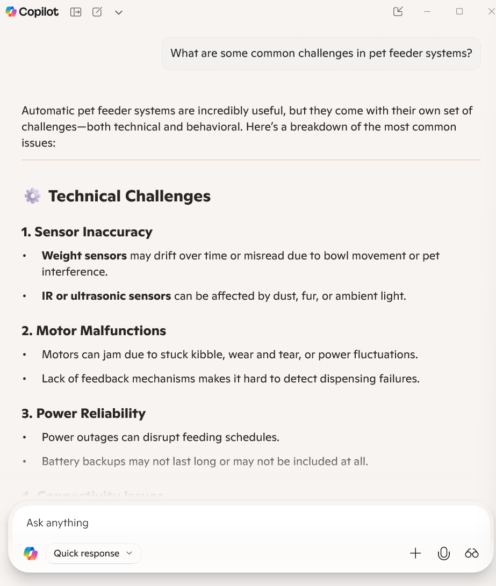

# Refining the solution- Writing test cases with values

### Assumptions

_Weight is taken in grams and time in minutes_

FEEDING_TIME= 8:00, 18:00,

MAXIMUM_BOWL_WEIGHT= 300,

MINIMUM_BOWL_WEIGHT= 20,

MAX_CONSUMPTION_TIME= 60

### CODE WITH TEST CASE

```
START
INITIALISE SYSTEM CLOCK
FEEDING_TIME= 8, 18:00,
MAXIMUM_BOWL_WEIGHT= 300,
MINIMUM_BOWL_WEIGHT= 20,
MAX_CONSUMPTION_TIME= 60

IF (SYSTEM_TIME = 8:00 or 18:00) THEN:
    IS_FEEDING_TIME = TRUE
    INITIAL_WEIGHT_OF_BOWL= WEIGHT_OF_BOWL

    IF FOOD_STOCK_PRESENT = TRUE :
       ROTATE THE MOTOR AND DISPENSE FOOD
       CHECK THE WEIGHT OF THE BOWL
       IF (CURRENT_WEIGHT_OF_BOWL = INITIAL_WEIGHT_OF_BOWL):
            ALERT "FOOD NOT DISPENSED"
       ELSE:
            CHECK THE WEIGHT OF THE BOWL
            IF (CURRENT_WEIGHT_OF_BOWL = MAXIMUM_BOWL_WEIGHT):
                IS_FEEDING_TIME = FALSE
            ELSE:
                IS_FEEING_TIME = TRUE
    ELSE (IF NOT FOOD_STOCK_PRESENT) :
        SEND ALERT MESSAGE "FOOD NOT PRESENT IN STOCK" AND TURN ON RED LED WITH ALARM
ELSE(IF NOT SYSTEM_TIME= FEEDING_TIME):
    WAIT FOR FEEDING TIME

MONITOR THE WEIGHT OF THE BOWL
IF (CURRENT_WEIGHT_OF_BOWL == WEIGHT_OF_THE_BOWL AND MAX_CONSUMPTION_TIME):
    ALERT "FOOD IS NOT EATEN" WITH RED LED AND ALARM
    WAIT FOR AN HOUR FOR THE FOOD TO BE CONSUMED AND CHECK THE WEIGHT OF THE BOWL
ELSE(IF WEIGHT IS NOT THE SAME):
    CHECK THE WEIGHT OF THE BOWL
    IF(WEIGHT_OF_BOWL < MINIMUM_BOWL_WEIGHT ):
        ALERT "FOOD COMPLETELY EATEN"
    ELSE(WEIGHT_OF_BOWL > MINIMUM_BOWL_WEIGHT):
        ALERT "FOOD PARTIALLY EATEN"

LOOP TO THE START, CHECK THE SYSTEM TIME AND WAIT FOR FEEDING TIME
```

### Test cases

#### Test case 1:

    1. When pets eats as expected, the system runs without any alerts and only displays messages for "Food completely eaten" or "Food partially eaten" and loops back to wait for the scheduled time.

#### Test case 2:

    2. When pets do not eat the food, an alert with the message "Food not eaten" is displayed.

#### Test case 3:

    3. When the food bin is empty, an alert of "Food not present in the stock" is given to the user with a red LED and buzzer.

### Further refining that can be made to the system

1. Smart system can be introduced so that the system automatically dispenses food when the bowl is empty instead of only during fixed scheduled time.

2. The system can be refined to introduce effective handling of cases when food is not dispensed so that manual attention is minimised.

# AI integration

I had firstly given copilot a rough sketch of my idea and asked what improvements could be made to the idea to make the system better. Copilot suggested me the mechanism for monitoring the weight for the system. It had suggested me to include the concept for upper and lower threshold weight beyond which an alert would be sent. I tweaked the idea and used it to include checks for food bowl overflow and food completely eaten. After having the solution ready and implementing the word code, I gave the solution to copilot and asked for additional feedback and improvements,it suggested me to include monitoring for not just empty stock but low stock level as well. It also suggested me to use a modular code structure by breaking the logic into functions.It also suggested me to add retry logic for sensor failures and motor errors and follow a logging approach to log errors with timestamp.




The system can be built using actual hardware by making use of different microcontrollers like Arduino or raspberry pi, sensors like weight sensors, IR sensors, real time clock and different buttons and knobs.The features can also be enhanced using cameras for pet monitoring.


I also tried to understand the common challenges in pet feeser systems which included various hardware failures like sensor inaccuracy and motor malfunctions. There can also be challenges including pet overeating or under-eating.


